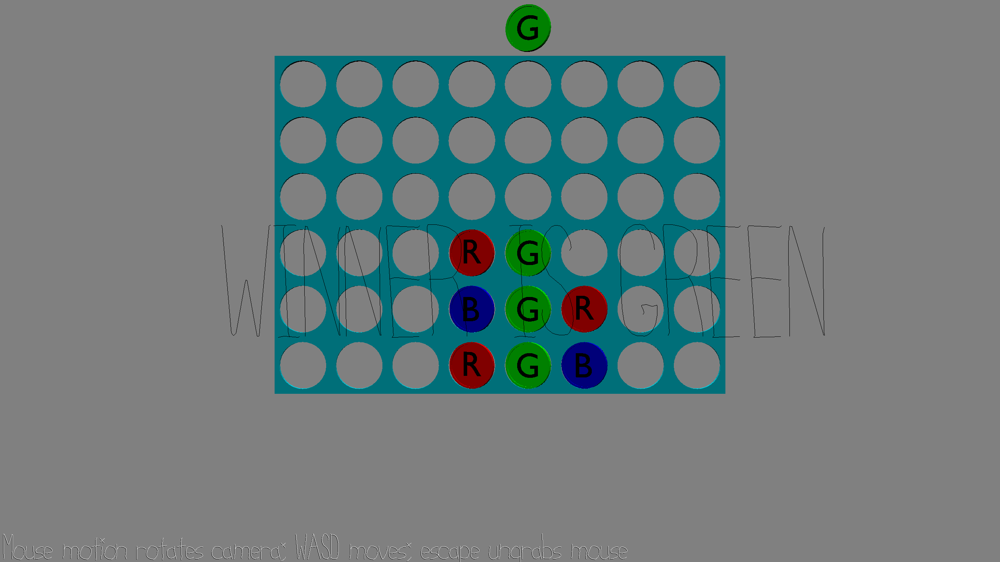

#  Invisible Three Threes

STARTING WITH GAME 2 AS BASE CODE

Author: Daniel Zeng (dlzeng)

Design: It's Connect 4 but with 3 players trying to get 3 in a row.

Screen Shot:

How To Play:

Use W, A, S, D to move around the camera. Mouse motion rotates the camera and escape to ungrab the mouse. Use the left and right arrows to move between columns and space bar to place a coin in the column. The ordering of the colors go RGB, BGR, RGB, etc. to make it more fair for the last player. Finally, the goal is to get three in a row first :).

This game was built with [NEST](NEST.md).
